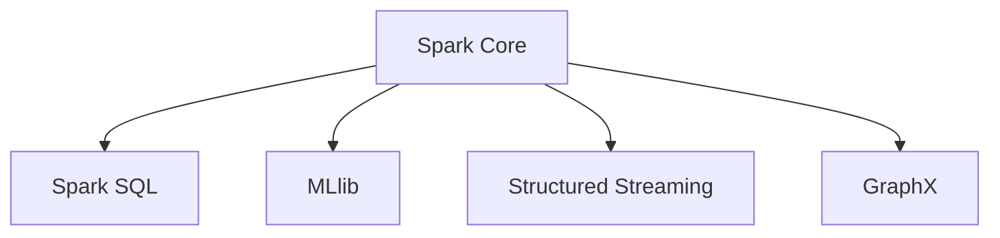

# Capítulo 1: Introducción al Big Data

## 1.1 ¿Qué es Big Data?

Big data no es solo "datos grandes". Es un fenómeno definido por las **5 V**:

| V | Significado | Ejemplo TechStore |
|---|-------------|-------------------|
| **Volumen** | Cantidad masiva de datos | 10M transacciones, 50M eventos |
| **Velocidad** | Datos generados en tiempo real | Eventos de navegación por segundo |
| **Variedad** | Diferentes formatos y fuentes | CSV, JSON, Parquet, texto libre |
| **Veracidad** | Calidad e incertidumbre de los datos | Reseñas con spam, datos incompletos |
| **Valor** | Capacidad de extraer insights | Predicciones, segmentaciones, recomendaciones |

### 1.1.1 El ecosistema Hadoop

Hadoop fue el pionero que democratizó el big data:

```
HDFS (almacenamiento distribuido)
  └── YARN (gestión de recursos)
       └── MapReduce (procesamiento)
            └── Ecosistema: Hive, Pig, HBase, Spark
```

**HDFS** divide archivos en bloques (128 MB por defecto) y los replica (3 copias) en múltiples nodos. Esto proporciona tolerancia a fallos y paralelismo.

**MapReduce** procesa datos en dos fases:
- **Map**: Transforma datos en pares clave-valor
- **Reduce**: Agrupa y agrega resultados

### 1.1.2 Apache Spark: el sucesor

Spark supera a MapReduce al mantener datos en memoria, logrando velocidades 10-100x superiores.

```python
# MapReduce mentalidad
datos = leer_desde_disco()
resultado = map_filter(datos)  # escribe a disco
final = reduce_agrupa(resultado)  # lee de disco

# Spark mentalidad
datos = spark.read.parquet("techstore/")
resultado = datos.filter(...).groupBy(...).agg(...)  # todo en memoria
```

**Componentes de Spark:**



## 1.2 Arquitectura de Spark

### 1.2.1 Cluster Mode

```python
# Modos de despliegue
modos = {
    "local": "Tu máquina, para desarrollo y pruebas",
    "standalone": "Cluster Spark gestionado por Spark",
    "yarn": "Recursos gestionados por YARN (Hadoop)",
    "kubernetes": "Contenedores orquestados por K8s"
}
```

**Componentes del cluster:**
- **Driver**: Programa principal con `SparkContext`
- **Master**: Gestiona recursos y planifica tareas
- **Worker**: Ejecuta tareas en sus cores
- **Executor**: Proceso JVM en cada worker que ejecuta tareas

### 1.2.2 SparkSession

```python
from pyspark.sql import SparkSession

spark = SparkSession.builder \
    .appName("TechStore-Analytics") \
    .config("spark.sql.adaptive.enabled", "true") \
    .config("spark.sql.adaptive.coalescePartitions.enabled", "true") \
    .config("spark.driver.memory", "4g") \
    .getOrCreate()

print(f"Spark version: {spark.version}")
# Spark version: 3.5.0
```

### 1.2.3 Lazy Evaluation

Spark usa evaluación perezosa: las transformaciones se registran en un DAG (Directed Acyclic Graph) y solo se ejecutan cuando una acción las dispara.

```python
# Transformaciones (no ejecutan nada)
df = spark.read.parquet("techstore/")
filtered = df.filter(df.amount > 100)
grouped = filtered.groupBy("category").count()

# Acción (dispara la ejecución)
result = grouped.collect()  # aquí Spark ejecuta todo el DAG
```

## 1.3 TechStore a Escala

Para este libro, generamos datos a escala de big data:

```python
from pyspark.sql import SparkSession
from pyspark.sql.functions import rand, when, col, expr
import random

spark = SparkSession.builder.appName("TechStore-Gen").getOrCreate()

# Generar 10 millones de transacciones
transactions = spark.range(10_000_000) \
    .withColumn("customer_id", (rand() * 100000).cast("int")) \
    .withColumn("product_id", (rand() * 5000).cast("int")) \
    .withColumn("amount", (rand() * 500 + 5).cast("decimal(10,2)")) \
    .withColumn("quantity", (rand() * 5 + 1).cast("int")) \
    .withColumn("timestamp", expr(
        "timestamp('2025-01-01') + interval rand() * 365 days"
    ))

transactions.write.mode("overwrite") \
    .parquet("data/techstore_transactions/")

print(f"Transacciones generadas: {transactions.count():,}")
# Transacciones generadas: 10,000,000
```

## 1.4 Comparativa de Rendimiento

```python
import time

# Modo clásico (pandas)
import pandas as pd
t0 = time.time()
pdf = pd.read_csv("techstore_10m.csv")  # ni siquiera cabe en RAM
t1 = time.time()

# Modo Spark
t2 = time.time()
sdf = spark.read.parquet("data/techstore_transactions/") \
    .filter(col("amount") > 100) \
    .groupBy("product_id") \
    .agg({"amount": "sum"})
sdf.collect()
t3 = time.time()

print(f"Spark: {t3-t2:.2f}s vs Pandas: {t1-t0:.2f}s (si cupiera)")
```

## 1.5 Ejercicios

1. **Conceptos**: Explica las 5 V del big data con ejemplos de TechStore.
2. **Arquitectura**: Dibuja el DAG de Spark para `df.filter().groupBy().agg().orderBy().show()`.
3. **SparkSession**: Crea una SparkSession con 2 GB de driver memory y nombre "MiApp".
4. **Generación**: Genera 1 millón de eventos de navegación TechStore con columnas: user_id, page, timestamp, duration_ms.
5. **Comparativa**: ¿Qué ventajas tiene Spark sobre Pandas para datasets > 10 GB?
