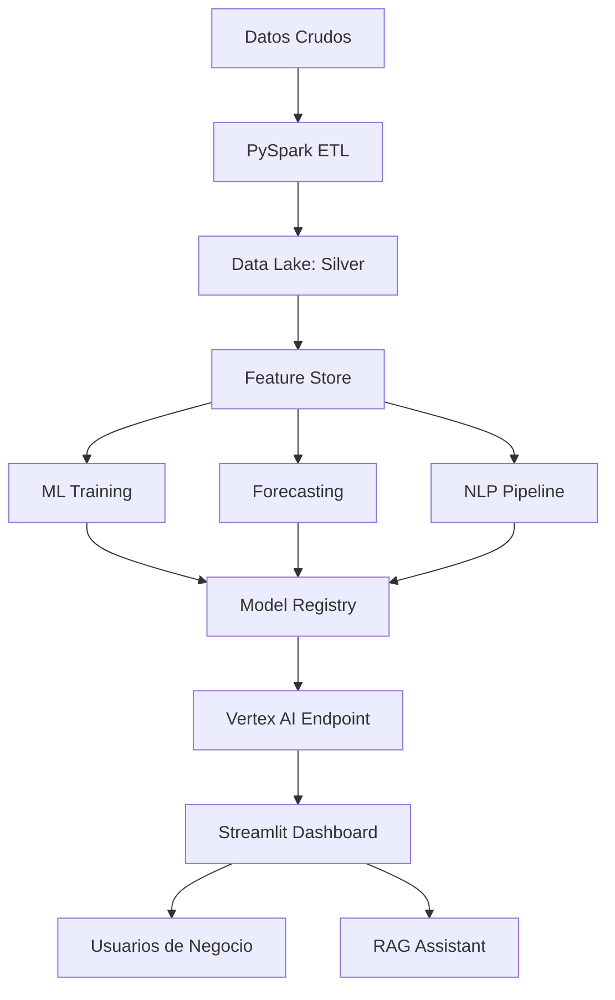

# Capítulo 15: Proyecto Final: Plataforma de Datos con IA

## 15.1 Visión General

El proyecto final integra todo lo aprendido en la colección completa para construir una **Plataforma de Datos con IA** para TechStore. Esta plataforma combina:

1. **Ingesta de datos** (big data con PySpark)
2. **Almacenamiento** (data lake en capas)
3. **Modelos predictivos** (ML con scikit-learn/XGBoost)
4. **Forecasting** (series temporales con Prophet)
5. **NLP** (análisis de sentimiento de reseñas)
6. **IA Generativa** (RAG con LangChain)
7. **Despliegue** (Vertex AI + Streamlit)

## 15.2 Arquitectura



## 15.3 Implementación

### 15.3.1 Capa de Datos

```python
# 1. Ingesta con PySpark
from pyspark.sql import SparkSession
from pyspark.sql.functions import col, year, month, day

spark = SparkSession.builder.appName("TechStore-Platform").getOrCreate()

# Leer y transformar
bronze = spark.read.parquet("data/raw/techstore_transactions/")
silver = bronze \
    .filter(col("amount").isNotNull()) \
    .withColumn("year", year("timestamp")) \
    .withColumn("month", month("timestamp")) \
    .withColumn("day", day("timestamp"))

silver.write.mode("overwrite") \
    .partitionBy("year", "month") \
    .parquet("data/lake/silver/transactions/")

# 2. Feature Store
features = spark.sql("""
    SELECT
        customer_id,
        COUNT(*) as freq,
        SUM(amount) as total_spent,
        AVG(amount) as avg_ticket,
        MAX(amount) as max_ticket,
        DATEDIFF(MAX(timestamp), MIN(timestamp)) as recency_days
    FROM silver
    GROUP BY customer_id
""")
features.write.mode("overwrite").parquet("data/feature_store/customer_features/")
```

### 15.3.2 Modelos en Producción

```python
# 3. Pipeline de ML
import joblib
import pandas as pd
from sklearn.ensemble import VotingRegressor
from xgboost import XGBRegressor
from lightgbm import LGBMRegressor

df_features = pd.read_parquet("data/feature_store/customer_features/")
y = df_features["total_spent"]
X = df_features.drop(["customer_id", "total_spent"], axis=1)

# Ensemble final
modelo_final = VotingRegressor([
    ("xgb", XGBRegressor(n_estimators=200, learning_rate=0.05)),
    ("lgbm", LGBMRegressor(n_estimators=200, learning_rate=0.05)),
    ("rf", RandomForestRegressor(n_estimators=100))
])
modelo_final.fit(X, y)

joblib.dump(modelo_final, "models/techstore_ensemble.pkl")

# 4. Forecast Prophet
from prophet import Prophet
df_daily = spark.sql("""
    SELECT date_trunc('day', timestamp) as ds, SUM(amount) as y
    FROM silver GROUP BY ds
""").toPandas()

model_prophet = Prophet(yearly_seasonality=False, weekly_seasonality=True)
model_prophet.fit(df_daily)
future = model_prophet.make_future_dataframe(periods=30)
forecast = model_prophet.predict(future)

# 5. NLP Sentiment
from sklearn.feature_extraction.text import TfidfVectorizer
from sklearn.linear_model import LogisticRegression

reviews = pd.read_parquet("data/raw/techstore_reviews/")
vectorizer = TfidfVectorizer(max_features=2000)
X_vec = vectorizer.fit_transform(reviews["review_text"])
sentiment_model = LogisticRegression()
sentiment_model.fit(X_vec, (reviews["rating"] >= 4).astype(int))

joblib.dump(vectorizer, "models/vectorizer.pkl")
joblib.dump(sentiment_model, "models/sentiment.pkl")
```

### 15.3.3 RAG Assistant

```python
# 6. Asistente RAG
from langchain_community.vectorstores import FAISS
from langchain_community.embeddings import HuggingFaceEmbeddings
from langchain.chains import RetrievalQA
from langchain_openai import ChatOpenAI

embeddings = HuggingFaceEmbeddings(model_name="all-MiniLM-L6-v2")
vectorstore = FAISS.load_local("data/vectorstore/techstore_docs", embeddings)

rag_assistant = RetrievalQA.from_chain_type(
    llm=ChatOpenAI(model="gpt-4", temperature=0.2),
    chain_type="stuff",
    retriever=vectorstore.as_retriever(k=5),
    return_source_documents=True
)
```

### 15.3.4 Dashboard Streamlit

```python
# 7. Dashboard unificado
import streamlit as st
import pandas as pd
import plotly.express as px
import plotly.graph_objects as go
import joblib
from datetime import datetime, timedelta

st.set_page_config(page_title="TechStore AI Platform", layout="wide")
st.title("TechStore AI Platform")
st.markdown("Plataforma integrada de datos, ML e IA")

# Sidebar
pagina = st.sidebar.selectbox(
    "Módulo",
    ["Dashboard", "Predict CLV", "Forecast", "Sentiment", "RAG Assistant"]
)

# Cargar modelos
modelo_clv = joblib.load("models/techstore_ensemble.pkl")
model_prophet = joblib.load("models/prophet.pkl")
sentiment_model = joblib.load("models/sentiment.pkl")
vectorizer = joblib.load("models/vectorizer.pkl")

if pagina == "Dashboard":
    col1, col2, col3, col4 = st.columns(4)
    col1.metric("Ventas Totales", "$12.5M", "+15%")
    col2.metric("Clientes Activos", "45,230", "+8%")
    col3.metric("Modelos en Prod", "4", "0")
    col4.metric("Forecast Accuracy", "92.3%", "+2.1%")

    # Gráfico de ventas
    df = pd.read_parquet("data/gold/ventas_diarias/")
    fig = px.line(df, x="fecha", y="ingresos", title="Ventas Diarias")
    st.plotly_chart(fig, use_container_width=True)

elif pagina == "Predict CLV":
    st.subheader("Predicción de CLV")
    col1, col2 = st.columns(2)
    with col1:
        freq = st.number_input("Frecuencia de compra", 1, 100, 15)
        avg_ticket = st.number_input("Ticket promedio ($)", 10, 5000, 150)
    with col2:
        recency = st.number_input("Días desde última compra", 0, 365, 7)
        max_ticket = st.number_input("Ticket máximo ($)", 10, 10000, 500)

    if st.button("Predecir CLV"):
        input_df = pd.DataFrame([[freq, avg_ticket, recency, max_ticket]],
                                columns=["freq", "avg_ticket", "recency_days", "max_ticket"])
        pred = modelo_clv.predict(input_df)[0]
        st.success(f"CLV Predicho: **${pred:,.2f}**")

elif pagina == "RAG Assistant":
    st.subheader("Asistente TechStore")
    pregunta = st.text_input("Haz una pregunta sobre TechStore:")
    if pregunta:
        with st.spinner("Analizando..."):
            respuesta = rag_assistant.invoke({"query": pregunta})
            st.write(respuesta["result"])
            with st.expander("Ver fuentes"):
                for doc in respuesta["source_documents"][:3]:
                    st.info(doc.page_content[:200])
```

## 15.4 Despliegue

```bash
# Docker Compose para la plataforma
docker-compose.yml:
version: '3.8'
services:
  streamlit:
    build: ./app
    ports:
      - "8501:8501"
    volumes:
      - ./models:/app/models
      - ./data:/app/data

  mlflow:
    image: ghcr.io/mlflow/mlflow:v2.10.0
    ports:
      - "5000:5000"
    command: mlflow server --host 0.0.0.0

  vectorstore:
    image: chromadb/chroma:latest
    ports:
      - "8000:8000"
```

## 15.5 Ejercicios

1. **Complete el proyecto**: Implementa todos los componentes de la plataforma TechStore AI.
2. **Dashboard**: Añade 3 visualizaciones más al dashboard de Streamlit (mapa de calor, distribución de CLV, forecast plot).
3. **RAG Avanzado**: Añade filtros por categoría de producto y fecha al asistente RAG.
4. **Monitoreo**: Implementa logging de todas las predicciones y alertas de drift.
5. **Documentación**: Crea documentación técnica de la plataforma con diagrama de arquitectura y guía de uso.
