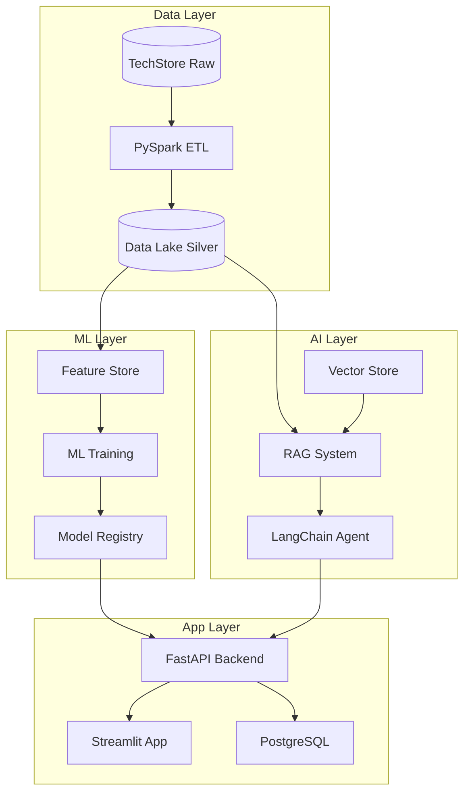

# Checkpoint 4: Plataforma de IA Integral

## Objetivo

Construir y desplegar la plataforma completa que integra todos los componentes del Proyecto Final. Este checkpoint valida que la plataforma funciona end-to-end.

## Arquitectura Completa



## Implementación

### Fase 1: Verificar Componentes

```python
import os
import joblib
import pandas as pd
from pathlib import Path

def verificar_plataforma():
    """Verificar que todos los componentes existen"""
    estado = {}

    # Data Lake
    estado["Data Lake"] = os.path.exists("data/lake/silver/transactions/")

    # Modelos
    estado["Modelo CLV"] = os.path.exists("models/techstore_ensemble.pkl")
    estado["Modelo Prophet"] = os.path.exists("models/prophet.pkl")
    estado["Modelo Sentiment"] = os.path.exists("models/sentiment.pkl")

    # Vector Store
    estado["Vector Store"] = os.path.exists("data/vectorstore/techstore_docs/")

    # Dashboard
    estado["Dashboard"] = os.path.exists("app/streamlit_app.py")

    return pd.Series(estado, name="Estado")

print("=== Verificación de Componentes ===")
for componente, existe in verificar_plataforma().items():
    status = "✅" if existe else "❌"
    print(f"  {status} {componente}")
```

### Fase 2: Validar Pipeline End-to-End

```python
# Pipeline completo: datos → predicción → dashboard
def pipeline_completo(customer_id=42, producto="laptop", pregunta="¿Cómo mejorar las ventas?"):
    resultados = {}

    # 1. CLV Prediction
    modelo = joblib.load("models/techstore_ensemble.pkl")
    df = pd.read_parquet("data/feature_store/customer_features/")
    customer_data = df[df["customer_id"] == customer_id]
    if not customer_data.empty:
        pred = modelo.predict(customer_data.drop(["customer_id", "total_spent"], axis=1))
        resultados["clv_predicted"] = float(pred[0])
        resultados["clv_actual"] = float(customer_data["total_spent"].iloc[0])

    # 2. Sentiment Analysis
    sentiment = joblib.load("models/sentiment.pkl")
    vectorizer = joblib.load("models/vectorizer.pkl")
    reviews = pd.read_parquet("data/raw/techstore_reviews/")
    producto_reviews = reviews[reviews["review_text"].str.contains(producto, case=False, na=False)]
    if not producto_reviews.empty:
        X = vectorizer.transform(producto_reviews["review_text"])
        predictions = sentiment.predict(X)
        resultados["sentiment_avg"] = float(predictions.mean())
        resultados["total_reviews"] = len(producto_reviews)

    # 3. Forecast
    forecast = pd.read_csv("data/gold/forecast_14d.csv")
    resultados["forecast_14d_sum"] = float(forecast["yhat"].sum())

    # 4. RAG Query
    from langchain_community.vectorstores import FAISS
    from langchain_community.embeddings import HuggingFaceEmbeddings
    from langchain.chains import RetrievalQA
    from langchain_openai import ChatOpenAI

    embeddings = HuggingFaceEmbeddings(model_name="all-MiniLM-L6-v2")
    vectorstore = FAISS.load_local("data/vectorstore/techstore_docs", embeddings)
    qa = RetrievalQA.from_chain_type(
        llm=ChatOpenAI(model="gpt-4", temperature=0.2),
        chain_type="stuff",
        retriever=vectorstore.as_retriever(k=3)
    )
    resultados["rag_response"] = qa.invoke({"query": pregunta})["result"][:200]

    return resultados

# Ejecutar
print("=== Pipeline End-to-End ===")
resultados = pipeline_completo()
for key, value in resultados.items():
    print(f"  {key}: {value}")
```

### Fase 3: API REST con FastAPI

```python
# app/api.py
from fastapi import FastAPI, HTTPException
from pydantic import BaseModel
import joblib
import pandas as pd
import uvicorn

app = FastAPI(title="TechStore AI Platform API")

# Cargar modelos
modelo = joblib.load("models/techstore_ensemble.pkl")
sentiment = joblib.load("models/sentiment.pkl")
vectorizer = joblib.load("models/vectorizer.pkl")

class CLVRequest(BaseModel):
    freq: int
    avg_ticket: float
    recency_days: int
    max_ticket: float

class SentimentRequest(BaseModel):
    text: str

@app.get("/health")
def health():
    return {"status": "ok", "models": ["clv", "sentiment"]}

@app.post("/predict/clv")
def predict_clv(req: CLVRequest):
    input_df = pd.DataFrame([[
        req.freq, req.avg_ticket, req.recency_days, req.max_ticket
    ]], columns=["freq", "avg_ticket", "recency_days", "max_ticket"])
    pred = modelo.predict(input_df)[0]
    return {"predicted_clv": float(pred)}

@app.post("/predict/sentiment")
def predict_sentiment(req: SentimentRequest):
    X = vectorizer.transform([req.text])
    pred = sentiment.predict(X)[0]
    proba = sentiment.predict_proba(X)[0].tolist()
    return {
        "sentiment": "positive" if pred == 1 else "negative",
        "confidence": max(proba)
    }

if __name__ == "__main__":
    uvicorn.run(app, host="0.0.0.0", port=8000)
```

### Fase 4: Dockerización

```dockerfile
# Dockerfile
FROM python:3.11-slim

WORKDIR /app

COPY requirements.txt .
RUN pip install --no-cache-dir -r requirements.txt

COPY . .

EXPOSE 8000
EXPOSE 8501

CMD ["uvicorn", "api:app", "--host", "0.0.0.0", "--port", "8000"]
```

```yaml
# docker-compose.yml
version: '3.8'

services:
  api:
    build: .
    ports:
      - "8000:8000"
    volumes:
      - ./models:/app/models
      - ./data:/app/data
    environment:
      - OPENAI_API_KEY=${OPENAI_API_KEY}

  streamlit:
    build: .
    ports:
      - "8501:8501"
    command: streamlit run streamlit_app.py --server.port 8501
    volumes:
      - ./models:/app/models
      - ./data:/app/data
    depends_on:
      - api

  mlflow:
    image: ghcr.io/mlflow/mlflow:v2.10.0
    ports:
      - "5000:5000"
    command: mlflow server --host 0.0.0.0 --backend-store-uri sqlite:///mlflow.db
    volumes:
      - mlflow_data:/mlflow

volumes:
  mlflow_data:
```

## Validación Final

```bash
# Probar API
curl -X POST http://localhost:8000/predict/clv \
  -H "Content-Type: application/json" \
  -d '{"freq": 15, "avg_ticket": 150, "recency_days": 7, "max_ticket": 500}'

# Probar health
curl http://localhost:8000/health
```

## Entregables

1. Código completo de la plataforma (ETL, ML, RAG, API, Dashboard)
2. Docker Compose funcional
3. API REST documentada (FastAPI + Swagger)
4. Dashboard Streamlit con 4+ módulos
5. Tests de integración end-to-end

## Criterios de Evaluación

| Criterio | Puntos |
|----------|--------|
| Todos los componentes funcionales | 25 |
| API REST con 3+ endpoints | 20 |
| Dashboard Streamlit completo | 20 |
| Dockerización funcional | 15 |
| Pipeline end-to-end probado | 10 |
| Documentación y tests | 10 |

¡Has completado la plataforma de datos con IA más completa para TechStore!
